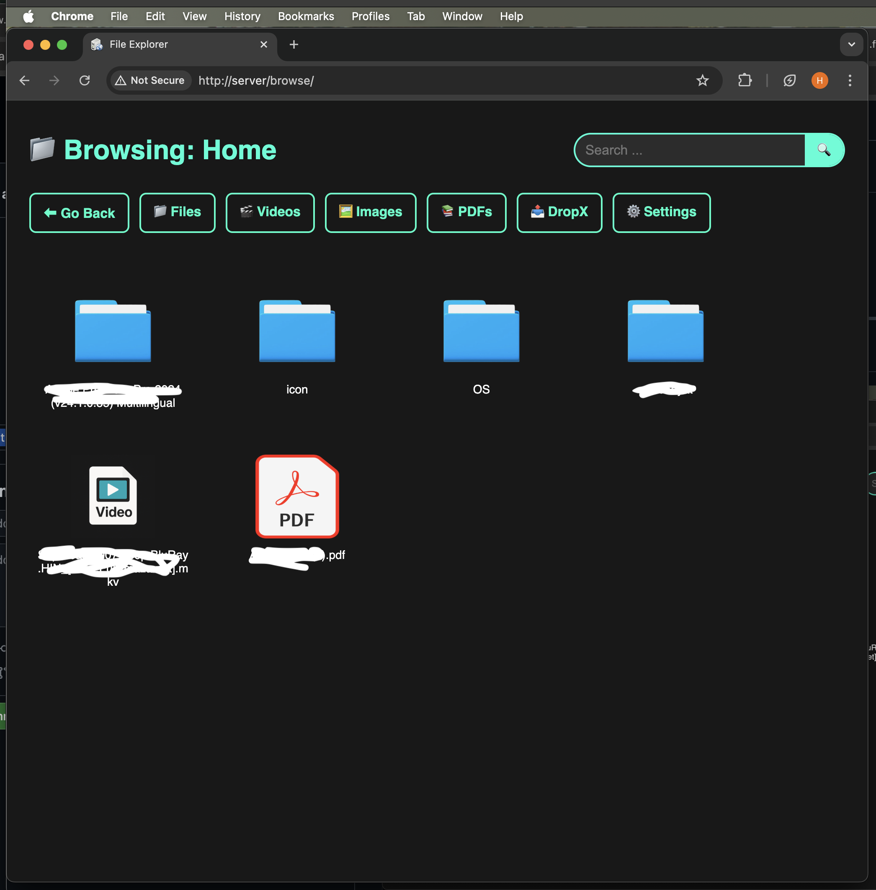

# Video Explorer

A simple web-based media explorer built with Python and Flask to browse, search, and play videos and PDFs on your SSD.

---

## Features

- Browse folders and files on your SSD
- View and play videos with built-in player
- Supports PDFs with a dedicated tab
- Sort files by recent activity
- Global Search Bar (also list other files)
- Hide hidden/system files (dot files)
- Hide some folders.(File-Explorer,Server,System Volume Information,etc.)
- Clean and responsive UI with custom icons and tabs
- Shows other files.(in new update)
---

## Technologies Used

- Python 3
- Flask web framework
- HTML, CSS (with Jinja2 templating)
- OS module for file handling

---

## How to Run

1. Clone the repository:
   ```bash
   git clone https://github.com/GoldernHaze/File-Explorer.git
   cd File-Explore

2. (Optional) Create and activate a virtual environment:
   ```bash
   python3 -m venv venv
   source venv/bin/activate  # on Windows: venv\Scripts\activate

3. Install dependencies:
    ```bash
    pip install flask
4. Update the path:
   make sure to update the path in app.py.

5. Run the app:
   ```bash
   python3 app.py

6. Open your browser and visit http://0.0.0.0 or address which it shows.

---
## What I Learned
- Python basics: file handling, functions, loops
- Flask web development: routing, templates, passing data
- HTML/CSS and Jinja2 templating
- Git and GitHub for version control and project hosting
---
## Screenshot


---
### My ssd structure for refrence
- I renamed FILE EXPLORER to Server
- I also hide some folders and files to keep my UI clean. You can also do by updating "app.py" by editing hidden_folders. 
      
      ssd/
      ├── Movies/
      │   ├── Movie 1/
      │   │   ├── video1.mp4
      │   │   ├── video2.mkv
      ├── Shows/
      │   ├── Show 1/
      │   │   ├── Episode 1.mp4
      │   │   ├── Episode 2.mp4
      │   ├── Show 2/
      ├── Server/
      │   ├── app.py
      │   ├── README.md
      │   ├── assets/
      │   ├── static/
      │   ├── templates/
      │   ├── venv/
      │   └── command_output.log
      ├── Books/
      │   ├── Book1/
      │   │   ├── Part 1.pdf
      │   │   ├── Part 2.pdf
      ├── SteamLibrary/
      ├── Daco_4630591.png
      ├── icon.bmp
      ├── autorun.inf
      ├── $RECYCLE.BIN/
      ├── System Volume Information/


---
### Author
GoldernHaze


